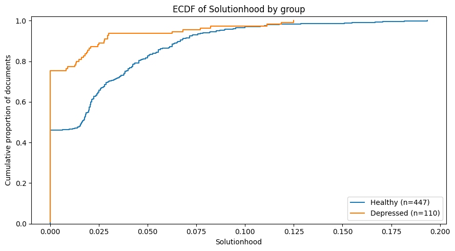

# Preliminary Report: Question–Response Organization in Depr-RST

*Quantitative group comparison and qualitative cross-parser analysis of RRT `Solutionhood` and RRG `topic`*

**Date:** 2026-08-19

**Status:** Preliminary exploratory report

## Method

Because the source essays were confidential, verbatim excerpts were not reproduced. The qualitative comparison was conducted on the original texts in a restricted research environment. Results are reported through aggregated coding, abstract descriptions of discourse configurations, synthetic examples, and pseudonymized document identifiers. A private audit table linking each coding decision to the corresponding confidential span was retained for verification.

Relation scope was classified using a simple three-level scheme. Nodes spanning two to four EDUs were treated as local. Nodes covering at least one quarter of the document, as well as root relations, were treated as macro-level. All remaining nodes were classified as intermediate. Scope was used as a secondary feature to explain some parser outputs.

Two separate sets of coding categories were used respectively to indicate:

- **why** the parsers disagree;
- **how good** the competing analyses are.

One primary category was used to indicate the mechanism of disagreement:

- `SEG` — segmentation difference;
- `INV` — relation-inventory difference;
- `ATT` — attachment or hierarchy difference;
- `CUE` — apparent sensitivity to a surface cue;
- `NOMAP` — no clean corresponding node because the trees diverge too much.

A secondary mechanism was also used when it was deemed necessary (e.g. `SEG + ATT`).

To assess the quality and plausibility of competing parser decisions the following categories were used:

- `AGREE` — same underlying interpretation despite different labels;
- `ALT` — plausible alternative analyses;
- `RRT?` — RRT assignment appears questionable;
- `RRG?` — RRG assignment appears questionable;
- `UNCLEAR` — evidence is insufficient to prefer either analysis.

Nuclearity was additionally explicitly record when:

- the parsers reverse the nucleus and satellite;
- nuclearity changes the interpretation;
- the inventories define the relation partly through nuclearity.

## Cliff Notes: `Solutionhood` in RRT vs. `topic` in RRG

At a high level, both frameworks agree on the fundamental architecture: the satellite (S) establishes a problem, question, or deficit, and the nucleus (N) steps in to provide the resolution or answer. However, they diverge in _how_ they identify this relation and, apparently, how rigidly they stick to surface-level markers versus deep pragmatic intent.

**RRT Manual:** **Solutionhood** **(Решение проблемы)**

- **Structural Definition:** A mononuclear relation where the satellite poses a problem (which can be formulated as a question, a request, a desire, a goal, or a lack of knowledge) and the nucleus offers a solution ([Manual.V1_, n.d.](http://nlp.isa.ru/projects/discourse/manual.v1.pdf)).
- **The Signaling Rule:** The guidelines explicitly instruct annotators to use this relation when there is an explicit marker present, specifically noting a rhetorical question and the answer to that question ([Manual.V1_, n.d.](http://nlp.isa.ru/projects/discourse/manual.v1.pdf)).
- **The Genre Exception:** Internal guidelines for annotators also include a specific addendum for blogs: given the conversational style of blogs, the `Solutionhood` relation may be assigned even if a rhetorical question is absent.

**eRST/GUM Manual:** **topic** **Macro-class (topic-solutionhood / topic-question)**

- **Pragmatic Definition:** Classified as a Presentational (pragmatic) relation. The core definition dictates that the satellite (S) is presented specifically in order to steer the discourse toward the nucleus (N) ([Rhetorical Structure Theory Annotation - eRST_, n.d.](https://wiki.gucorpling.org/gum/rst)).
- **Fine-Grained Subtypes:** The guidelines distinguish between `topic-solutionhood` (where N is a solution to a problem presented by S) and `topic-question` (where N is the direct answer to a question posed by S) ([Rhetorical Structure Theory Annotation - eRST_, n.d.](https://wiki.gucorpling.org/gum/rst)).
- **The Question Rule:** The eRST manual has a dedicated rule for handling questions, dictating that questions are typically seen as satellites to their respective answers and must be linked using the `topic-solutionhood` (or `topic-question`) relation ([Rhetorical Structure Theory Annotation - eRST_, n.d.](https://wiki.gucorpling.org/gum/rst)).

---

## Corpus Level Pattern for RRT-derived `Solutionhood`

The distribution of `Solutionhood` in the RRT-derived trees was strongly zero-inflated in both groups, but substantially more so among the depressed texts. Approximately three quarters of depressed documents contained no `Solutionhood` relations, compared with fewer than half of the healthy documents. Although several depressed texts showed relatively high `Solutionhood` proportions, these represented a small upper-tail subset. The healthy group displayed a broader and generally higher distribution, indicating that Solutionhood was both more frequently present and more extensively represented across healthy texts.

|     | group     | n_documents | present_pct | zero_pct  | median_all | median_when_present | p90      | max      |
| --- | --------- | ----------- | ----------- | --------- | ---------- | ------------------- | -------- | -------- |
| 0   | Healthy   | 447         | 53.914989   | 46.085011 | 0.016393   | 0.036364            | 0.066667 | 0.193548 |
| 1   | Depressed | 110         | 24.545455   | 75.454545 | 0.000000   | 0.024390            | 0.027548 | 0.125000 |

**Table 1. Overall Distribution of `Solutionhood` in the RRT-derived Trees**

As can be seen from Table 1 above, RRT-derived `Solutionhood` proportions were strongly zero-inflated in both groups, but especially among depressed texts. The relation occurred in 53.9% of healthy documents, compared with only 24.5% of depressed documents; correspondingly, 75.5% of depressed texts contained no `Solutionhood` at all. The median across all documents was therefore zero in the depressed group, compared with 0.016 in the healthy group. The difference was not limited to relation presence: among documents containing at least one `Solutionhood` relation, the median proportion was also higher in healthy texts (0.036 versus 0.024). The upper part of the healthy distribution was likewise broader, with a 90th-percentile value of 0.067 compared with 0.028 in the depressed group. Nevertheless, the distributions overlapped, and a small number of depressed documents reached relatively high values, with a maximum of 0.125. Thus, high `Solutionhood` is not exclusive to healthy texts; rather, it is substantially more widespread and generally more prominent within that group.

## Sampling and Qualitative Explanation (RRT-derived `Solutionhood` vs RRG-derived `topic`)

### Upper Tail Cases: `Solutionhood` in The Healthy Group

To examine how high `Solutionhood` proportions arise in individual texts, an upper-tail qualitative sample was selected separately from the healthy and depressed groups. Documents were ranked by their RRT-derived `Solutionhood` proportion, and the two and three highest-ranking texts in each group respectively were inspected comparatively using the RRT and RRG trees. The comparison considered the raw number of target relations, the total number of relations, differences in EDU segmentation, and the labels assigned to corresponding spans by the two parsers.

| #   | doc_id  | RRT Solutionhood | RRG topic    | Difference |
| --- | ------- | ---------------- | ------------ | ---------- |
| 0   | doc-551 | 12/62 = 0.194    | 6/67 = 0.09  | +0.104     |
| 1   | doc-371 | 8/44 = 0.182     | 3/52 = 0.058 | +0.124     |
| 2   | doc-274 | 7/41 = 0.171     | 2/46 = 0.043 | +0.127     |
| 3   | doc-193 | 7/42 = 0.167     | 3/54 = 0.056 | +0.111     |
| 4   | doc-427 | 13/84 = 0.155    | 7/89 = 0.079 | +0.076     |
|     |         |                  |              |            |

**Table 2. Highest RRT `Solutionhood` values in the healthy group and corresponding RRG `topic` values**

The two highest-ranking healthy documents contained substantial numbers of RRT `Solutionhood` relations: 12 of 62 relations in doc-551 and 8 of 44 in doc-371. The corresponding RRG trees also contained `topic` relations, but at consistently lower proportions. The RRT–RRG differences ranged from approximately 0.104 to 0.127. Thus, the selected texts appear to contain a genuine concentration of question–answer or problem–response organization, but RRT represents this organization more extensively than RRG (more on which below).

Doc-551 had the highest `Solutionhood` proportion in the healthy group. RRT assigned 12 of 62 relations to `Solutionhood` (0.194), whereas RRG assigned 6 of 67 relations to `topic` (0.090). RRG also produced slightly more EDUs and total relations than RRT, so the proportional difference reflects both a lower target-relation count and a somewhat different segmentation.

The qualitative analysis revealed that the text is strongly organized around self-directed questions followed by attempted answers or extended reflection (such as: "What am I supposed to do? Stop exposing myself to public scrutiny or expose myself to it even more?"). It therefore genuinely contains the type of interactive structure that can motivate a problem–solution or question–answer analysis even if not questions get a real answer to the question asked or present a solution. This is registered by both parsers.

The qualitative inspection further showed that RRT applied `Solutionhood` more broadly than RRG applied `topic`. Of the twelve RRT `Solutionhood` nodes in the selected text, only one had a close functional counterpart in the RRG tree. In other cases, RRG analyzed the same material using `elaboration`, `restatement`, `organization`, or `explanation`, or embedded it within a substantially different hierarchy that prevented direct node-to-node mapping. A recurrent source of disagreement involved layered interrogative complexes. RRT often assigned multiple nested `Solutionhood` relations between general questions, more specific questions, proposed alternatives, and subsequent responses. RRG more frequently treated the questions and alternatives as internally related through `elaboration` or `organization` and reserved `topic` for a broader transition from the complete question complex to an answer or response. In other words, RRG treats the alternatives as an elaboration of the initial question, whereas RRT interprets them as possible solutions. Since the alternatives remain interrogative rather than resolving the question, the RRT analysis appears slightly less convincing. The elevated RRT `Solutionhood` proportion therefore reflects both genuine question–response organization in the text and a parser-specific tendency to represent that organization through a larger number of local and nested `Solutionhood` nodes.

This pattern may be related to the annotation conventions underlying the RRT corpus. The annotation manual explicitly identifies interrogative punctuation as a cue for `Solutionhood`. In the automatically produced trees, `Solutionhood` was repeatedly assigned not only to clear question–answer sequences but also to questions followed by alternatives, reformulations, or further questions (such as this synthetic example used above: "What am I supposed to do? Stop exposing myself to public scrutiny or expose myself to it even more?"). The observed pattern may therefore be consistent with the parser having learned heightened sensitivity to explicit interrogative cues from the annotated training data. However, because the parser’s internal decision process was not examined directly, punctuation cannot be established as the immediate cause of any individual prediction.

For convenience, this recurrent output pattern is referred to below as a “question-mark reflex”: a tendency to assign `Solutionhood` broadly around explicitly interrogative spans. The term describes the observed output behavior rather than a verified internal rule of the parser.

Doc-371 had the second-highest RRT `Solutionhood` proportion in the healthy group. RRT assigned 8 of 44 relations to `Solutionhood` (0.182), whereas RRG assigned 3 of 52 relations to `topic` (0.058), producing a cross-parser difference of 0.124.

Although both trees identified question–response organization in the text, the RRT analysis represented it much more extensively, particularly through several intermediate- and macro-level `Solutionhood` nodes whose spans were broader than the corresponding RRG structures. The eight RRT `Solutionhood` relations in doc-371 showed limited direct correspondence with RRG `topic`. Only one instance exhibited close functional agreement, while two represented plausible alternative analyses. Three RRT assignments appeared questionable, and two additional macro-level structures were difficult to justify under either parser analysis. The principal source of disagreement was attachment and hierarchical organization: the parsers frequently connected differently bounded question and response spans or placed approximately corresponding relations at different levels of the tree. This tendency was particularly pronounced at the macro level, which accounted for four of the eight RRT `Solutionhood` nodes. In several cases, RRT incorporated substantial amounts of discourse that did not directly answer the relevant question, thereby producing unusually extensive `Solutionhood` spans. Consequently, the high RRT proportion in this document again appears to reflect a combination of genuine question–response organization and parser-specific amplification caused primarily by broad attachment decisions rather than by relation-label differences alone.

### Upper Tail Cases: `Solutionhood` in the Depressed Group

The depressed-group distribution was strongly zero-inflated: 75.5% of documents contained no RRT `Solutionhood` relations, and only 27 of 110 documents had positive values. Among these non-zero cases, the median proportion was relatively low at 0.024. Nevertheless, the distribution contained a sparse upper tail extending to 0.125, substantially above the group’s 90th-percentile value of 0.028. The upper tail therefore overlapped with the healthy distribution, indicating that a small subset of depressed texts exhibited comparatively extensive `Solutionhood` organization despite the relation being absent or uncommon in most depressed documents.

| #   | doc_id  | RRT Solutionhood | RRG topic     | Difference |
| --- | ------- | ---------------- | ------------- | ---------- |
| 0   | doc-88  | 2/16 = 0.125     | 0/19 = 0.0    | +0.125     |
| 1   | doc-84  | 7/59 = 0.119     | 8/62 = 0.129  | -0.010     |
| 2   | doc-69  | 2/18 = 0.111     | 1/18 = 0.056  | +0.056     |
| 3   | doc-102 | 7/85 = 0.082     | 2/105 = 0.019 | +0.063     |
| 4   | doc-82  | 2/26 = 0.077     | 1/31 = 0.032  | +0.045     |

**Table 3. Highest RRT `Solutionhood` values in the depressed group and corresponding RRG `topic` values**

The three highest-ranking depressed documents reached similar RRT `Solutionhood` proportions, ranging from 0.111 to 0.125, but their cross-parser profiles differed substantially. In doc-84, the two parsers showed close agreement: RRT assigned 7 of 59 relations to `Solutionhood`, while RRG assigned 8 of 62 relations to `topic`. This suggests a genuine and extensive concentration of question–response organization in the text. By contrast, doc-88 contained two RRT `Solutionhood` relations but no RRG `topic` relations, indicating a pronounced parser-specific divergence. Doc-69 occupied an intermediate position, with both parsers identifying the relevant organization but RRT assigning two target relations compared with one in RRG. The depressed upper tail is therefore heterogeneous: it includes at least one case of strong cross-parser convergence and other cases in which high RRT proportions are partly amplified by parser-specific labeling or attachment decisions. Because doc-88 and doc-69 are relatively short, small differences in raw relation counts also produce comparatively large proportional differences.

Doc-88’s position at the top of the depressed-group distribution appears to be partly parser-driven. One of its two RRT `Solutionhood` relations represents a plausible alternative analysis of a complex reflective passage, but the second is a questionable macro-level attachment with no RRG counterpart. The document therefore does contain _some_ genuine question–response organization, yet its unusually high RRT proportion is amplified by the small denominator and by one structurally and semantically doubtful `Solutionhood` assignment. In contrast to doc-84 (discussed below), where high question–response organization is recognized by both parsers, doc-88 reaches a similar RRT proportion through only two assignments, one of which appears to be a macro-level parsing artifact.

Unlike the healthy upper-tail cases, where RRT was consistently higher than RRG, the depressed upper tail includes one document—doc-84—in which RRG `topic` is slightly more frequent than RRT `Solutionhood`. Overall, doc-84 provides the clearest depressed-group example of genuine cross-parser convergence. Its high `Solutionhood`/`topic` values reflect repeated and recognizable question–answer organization rather than broad inflation by RRT alone. The two parsers largely agree on the presence and function of the relevant structures, diverging mainly over the boundaries of answer spans and one likely spurious RRG `topic` relation introduced via a parser error. Thus, unlike doc-88, doc-84 appears to occupy the depressed upper tail for substantive discourse-organizational reasons, with only limited parser-specific distortion.

Doc-69 represents a mixed case. Both parsers independently recognize a genuine question–answer structure, accounting for one RRT `Solutionhood` relation and the single RRG `topic` relation. RRT, however, embeds this structure within broader hierarchical spans and subsequently introduces an additional root-level `Solutionhood` analysis with no RRG counterpart. Its elevated RRT proportion therefore appears to combine genuine question–response organization with moderate parser-specific amplification at the macro level.

Overall, the upper-tail analysis demonstrates that a high document-level `Solutionhood` proportion cannot be interpreted straightforwardly as evidence of unusually extensive question–response organization. Similar quantitative values can result from genuine cross-parser agreement, repeated local or nested relation assignment, broad macro-level attachment, or the disproportionate influence of a small number of relations in short trees. At the same time, the RRT upper tail is not reducible to parser error: all examined documents contained at least _some_ plausible question–response organization. The principal cross-parser difference lies instead in **how extensively and at what hierarchical level that organization is represented**. RRT frequently extends `Solutionhood` across additional nested or macro-level structures, whereas RRG tends to represent parts of the same discourse through a more differentiated relation inventory and different attachment decisions.

Because these documents were deliberately selected from the extreme upper tail of the distribution, the observed mechanisms should be interpreted as explanations of extreme `Solutionhood` values rather than as representative properties of healthy or depressed texts in general.

### Typical Healthy Sample: Texts Containing `Solutionhood` Proportions around Median Values

| #   | doc_id  | ds       | ds_num | rrt_solutionhood | rrt_solutionhood_count | rrt_total_relations | rrt_num_edus | rrg_topic | rrg_topic_count | rrg_total_relations | rrg_num_edus | delta_rrt_rrg | distance_from_median |
| --- | ------- | -------- | ------ | ---------------- | ---------------------- | ------------------- | ------------ | --------- | --------------- | ------------------- | ------------ | ------------- | -------------------- |
| 0   | doc-326 | здоровые | 0      | 0.036364         | 2                      | 55                  | 56.0         | 0.017241  | 1               | 58                  | 59.0         | 0.019122      | 0.000000             |
| 1   | doc-164 | здоровые | 0      | 0.036364         | 2                      | 55                  | 56.0         | 0.034483  | 2               | 58                  | 59.0         | 0.001881      | 0.000000             |
| 2   | doc-364 | здоровые | 0      | 0.036364         | 2                      | 55                  | 56.0         | 0.016393  | 1               | 61                  | 62.0         | 0.019970      | 0.000000             |
| 3   | doc-199 | здоровые | 0      | 0.035714         | 3                      | 84                  | 85.0         | 0.011236  | 1               | 89                  | 90.0         | 0.024478      | 0.000649             |
| 4   | doc-183 | здоровые | 0      | 0.035461         | 5                      | 141                 | 142.0        | 0.020000  | 3               | 150                 | 151.0        | 0.015461      | 0.000903             |

**Table 4: Healthy Median Candidates**

| #   | doc_id | ds        | ds_num | rrt_solutionhood | rrt_solutionhood_count | rrt_total_relations | rrt_num_edus | rrg_topic | rrg_topic_count | rrg_total_relations | rrg_num_edus | delta_rrt_rrg | distance_from_median |
| --- | ------ | --------- | ------ | ---------------- | ---------------------- | ------------------- | ------------ | --------- | --------------- | ------------------- | ------------ | ------------- | -------------------- |
| 0   | doc-39 | депрессия | 1      | 0.024390         | 1                      | 41                  | 42.0         | 0.023256  | 1               | 43                  | 44.0         | 0.001134      | 0.000000             |
| 1   | doc-49 | депрессия | 1      | 0.025000         | 2                      | 80                  | 81.0         | 0.000000  | 0               | 89                  | 90.0         | 0.025000      | 0.000610             |
| 2   | doc-58 | депрессия | 1      | 0.027523         | 3                      | 109                 | 110.0        | 0.000000  | 0               | 108                 | 109.0        | 0.027523      | 0.003133             |
| 3   | doc-87 | депрессия | 1      | 0.027778         | 1                      | 36                  | 37.0         | 0.025000  | 1               | 40                  | 41.0         | 0.002778      | 0.003388             |
| 4   | doc-5  | депрессия | 1      | 0.020833         | 1                      | 48                  | 49.0         | 0.017241  | 1               | 58                  | 59.0         | 0.003592      | 0.003557             |

**Table 5: Depressed Median Candidates***

To complement the upper-tail analysis, one typical non-zero case was selected from each group. Doc-39 was chosen for the depressed group because its RRT `Solutionhood` proportion (0.0244) exactly matched the median among depressed documents in which `Solutionhood` was present. Doc-164 was selected analogously for the healthy group, with an RRT proportion of 0.0364, also exactly matching the corresponding non-zero median. Both documents additionally showed close cross-parser agreement in their target-relation proportions, making them useful for examining typical realizations of question–response organization without the comparison being dominated by unusually strong parser disagreement. The goal behind exploring this sample is to understand what an "ordinary", non-extreme `Solutionhood` structure looks like in each group when both parsers broadly agree that it is there.

Overall, doc-39 represents a relatively typical and cross-parser-stable realization of the feature in the depressed group. Unlike the upper-tail cases, its `Solutionhood` value is generated by a single intermediate-level relation recognized almost identically by both parsers. At the same time, the passage illustrates that even cross-parser agreement does not necessarily imply an unambiguous question–answer relation: here, `Solutionhood`/`topic` appears to capture a broader transition from problem formulation to the writer’s response to that problem. (The functional interpretation of the outer relation itself is somewhat less clear-cut. The satellite contains an explicit question concerning the origin or nature of the writer’s condition, but the nucleus does not directly answer that question. Instead, it shifts toward the writer’s desire to live normally and to be free of the described condition. The passage can therefore be read as a broad problem–response transition, which makes the parsers’ analysis defensible, but it does not constitute a prototypical question followed by an answer. An alternative reading is that the initial span primarily introduces or frames the writer’s subsequent stance toward the condition.)

As an additional observation, apart from this single question–response complex, doc-39 is dominated by relatively linear, sequential discourse development. In the RRT-derived tree, `Sequence` and `Joint` each account for approximately 29.3% of all relations, while in the RRG-derived tree `joint` alone accounts for approximately 60.5%. Although these labels are not directly equivalent across the two relation inventories, both analyses therefore characterize much of the text as progressing through additive or sequentially linked units rather than through repeated question–response structures. This is broadly consistent with the [preliminary corpus-level findings](./preliminary-report-cross-model-rst-depr-rst.md), which suggested a greater prominence of linear and sequential organization in the depressed group, whereas the healthy group showed relatively more interactive or question–response organization. The present case may therefore be treated as a qualitative illustration of that broader tendency rather than as independent evidence for it.

Doc-164 in turn demonstrates that near-identical document-level `Solutionhood` and `topic` proportions do not necessarily imply node-level agreement. Both parsers identify substantial interrogative and question–response organization, but only one of their target relations corresponds straightforwardly at the level of discourse function. RRT additionally assigns `Solutionhood` to a question reformulation that RRG treats as `restatement`, while RRG identifies a separate `topic` structure that RRT analyzes as `Elaboration`. The almost identical aggregate proportions therefore arise partly through compensating differences in relation assignment rather than through one-to-one correspondence between the two trees.

Compared with the depressed median case, doc-164 contains a more distributed and structurally complex interrogative organization. Doc-39 contains a single broadly shared problem–response structure, whereas doc-164 contains several competing opportunities for question–response analysis, with the two parsers differing over which of these should receive the target relation.

### Biggest Disagreement Samples: Text with the Biggest Difference in the Proportions of `Solutionhood`

Sample C targeted documents showing the largest cross-parser differences in the proportional frequency of RRT `Solutionhood` and RRG `topic`. The disagreement was strongly asymmetric. The three largest positive differences ranged from +0.124 to +0.127 and all favored RRT; these documents had already been included in the upper-tail analysis. By contrast, the largest differences favoring RRG were considerably smaller, ranging from −0.024 to −0.033. In each of these cases, RRT assigned no `Solutionhood` relations, whereas RRG assigned a single `topic` relation. The latter cases were therefore examined to determine which discourse configurations RRG categorized as `topic` but RRT represented differently.

Table 6 presents the five documents with the largest positive difference between RRT `Solutionhood` and RRG `topic` proportions. Four of the five cases were subsequently examined qualitatively.

| #   | Document | Group     | RRT Solutionhood | RRG topic    | Difference |
| --- | -------- | --------- | ---------------- | ------------ | ---------- |
| 0   | doc-274  | Healthy   | 7/41 = 0.171     | 2/46 = 0.043 | +0.127     |
| 1   | doc-88   | Depressed | 2/16 = 0.125     | 0/19 = 0.000 | +0.125     |
| 2   | doc-371  | Healthy   | 8/44 = 0.182     | 3/52 = 0.058 | +0.124     |
| 3   | doc-193  | Healthy   | 7/42 = 0.167     | 3/54 = 0.056 | +0.111     |
| 4   | doc-551  | Healthy   | 12/62 = 0.194    | 6/67 = 0.090 | +0.104     |

**Table 6: Biggest Positive Difference between RRT `Solutionhood` and RRG `topic`**

The five largest positive cross-parser differences ranged from +0.104 to +0.127, indicating a very similar degree of divergence across the extreme positive tail. In every case, RRT assigned substantially more `Solutionhood` relations than RRG assigned `topic`. Four of the five documents belonged to the healthy group, although diagnostic group was not used as a selection criterion for this sample.

Overall, doc-274 provides a particularly clear example of **parser-specific amplification of genuine question–response structure**. The essay contains substantial interrogative organization, but RRT repeatedly decomposes broader question–response configurations into multiple local or nested `Solutionhood` relations and occasionally assigns `Solutionhood` to spans whose following material does not constitute a direct answer. RRG generally represents the same discourse through fewer, broader `topic` relations or through other relations such as `joint` and `evaluation`. The exceptionally large positive delta therefore reflects both genuine rhetorical signal and a systematic difference in granularity and attachment strategy between the two parsers.

Four of these five documents—docs 274, 88, 371, and 551—were examined qualitatively, of which three documents have already been analyzed as part of the exploration of the upper tail cases. Their analysis showed that the large positive differences do not reflect a single parser failure mode. Instead, they arise from several related ways in which RRT represents question–response organization more extensively than RRG.

Doc-274, the document with the largest positive difference (+0.127), provided the clearest example of parser-specific amplification through fragmentation and nested analysis. RRT identified seven `Solutionhood` relations compared with two RRG `topic` relations. Several of the RRT nodes represented parts of broader question–response structures that RRG captured through a smaller number of more extensive `topic` relations. In particular, RRT sometimes attached only the initial portion of an extended answer and subsequently constructed another `Solutionhood` node above it, effectively distributing a single broader rhetorical configuration across multiple target relations. Other RRT assignments appeared sensitive to interrogative form even where the following material functioned more plausibly as reflection, evaluation, or preparation for a later answer. At the same time, genuine question–response organization was clearly present, and not every RRT–RRG difference favored the RRG analysis.

As was already discussed above, Doc-551 showed a related but especially strong tendency toward repeated local and nested `Solutionhood` assignments. RRG often analyzed the same material through relations such as `elaboration`, `restatement`, `organization`, and `explanation`, or embedded it within hierarchies for which no single `topic` node corresponded to an RRT `Solutionhood` relation. The resulting excess therefore arose largely from RRT representing interrogative material through a denser sequence of target relations.

In doc-371 (again, as discussed above), the primary source of divergence was somewhat different. Here attachment and hierarchical scope played a larger role, with several RRT `Solutionhood` relations operating at intermediate or macro levels. Some of these incorporated broader spans than their closest RRG counterparts, including material that only indirectly participated in the relevant question–response configuration. Thus, RRT inflation in this document was associated less with repeated local questioning than with expansive higher-level attachment.

Doc-88 demonstrated how document length can further magnify these parser differences. The RRT tree contained only 16 relations, so two `Solutionhood` assignments were sufficient to produce a proportion of 0.125, while RRG contained no `topic` relations. One of the two RRT assignments represented a defensible alternative analysis, whereas the other was a questionable macro-level attachment. Its large positive delta therefore resulted from a combination of genuine rhetorical signal, parser-specific analysis, and a small denominator.

Taken together, the manually inspected positive-delta cases indicate that RRT tends to accumulate `Solutionhood` through finer-grained, nested, and sometimes broader hierarchical analyses, whereas RRG more often consolidates comparable discourse into fewer `topic` relations or assigns other relation labels to parts of the same structure. The positive divergence is therefore not reducible to simple RRT false positives: the inspected documents generally contain genuine interrogative or problem–response organization. The principal difference lies in how many target relations the parsers derive from that organization and at what level of the discourse hierarchy they place them. Recurrent sources of divergence include fragmentation of extended answers across several RRT nodes, repeated nested `Solutionhood` relations, broader macro-level attachment, and occasional sensitivity to interrogative surface cues where the following span is not a prototypical answer. The convergence of these mechanisms across four of the five most extreme positive-delta documents suggests that further auditing of the fifth case, doc-193, is unlikely to be necessary for identifying the principal source of the positive-tail discrepancy.

In cases when RRG actually produced a higher resulting proportion of the relation in question, the delta was substantially smaller. All the five samples given in Table 7 were analyzed qualitatively. Overall, the strongest RRG-over-RRT disagreements appear to arise predominantly from attachment and hierarchical organization rather than from simple label substitution. In four of the five inspected cases, RRG recovered an additional plausible question–response structure that RRT suppressed by incorporating the interrogative material into a broader `Joint` configuration. The remaining case showed the reverse problem, with RRG apparently imposing a `topic` interpretation on a structure more plausibly analyzed as evaluation. Thus, although RRG exceeds RRT only modestly in the negative-delta tail, these cases reveal a systematic complementary failure mode: RRT may miss question–response organization when the question is embedded within a larger span or lacks a straightforward local attachment.

When RRT greatly exceeds RRG, the difference often results from RRT multiplying or extending `Solutionhood` through nested and macro-level analyses. When RRG exceeds RRT, the discrepancy is much smaller and usually reflects a single question–response structure that RRT absorbs into another hierarchical configuration, frequently `Joint`.

| #   | Document | Group     | RRT Solutionhood | RRG topic    | Difference |
| --- | -------- | --------- | ---------------- | ------------ | ---------- |
| 0   | doc-95   | Depressed | 0/23 = 0.000     | 1/30 = 0.033 | -0.033     |
| 1   | doc-419  | Healthy   | 0/31 = 0.000     | 1/34 = 0.029 | -0.029     |
| 2   | doc-400  | Healthy   | 0/36 = 0.000     | 1/41 = 0.024 | -0.024     |
| 3   | doc-113  | Healthy   | 1/45 = 0.022     | 2/43 = 0.047 | -0.024     |
| 4   | doc-130  | Healthy   | 1/35 = 0.029     | 2/38 = 0.053 | -0.024     |

**Table 7: Biggest Negative Difference between RRT `Solutionhood` and RRG `topic`**

## Preliminary Conclusion

Taken together, the quantitative and qualitative analyses suggest a systematic difference in question–response or problem–response organization between the healthy and depressed groups. In the RRT-derived data, `Solutionhood` was substantially more characteristic of healthy texts: approximately 54% of healthy documents contained at least one `Solutionhood` relation, compared with only 25% of depressed documents, and the median proportion _among documents in which the relation occurred_ was also higher in the healthy group (0.036 versus 0.024). The group difference remained significant after multiple-comparison correction, with a non-trivial effect size (see the reports [here](./)). Importantly, the RRG-derived data showed the same directional tendency for `topic`. Thus, although `Solutionhood` and `topic` are not formally equivalent relations, both parsers independently associate the healthy group with a greater amount of discourse organization in which questions, problems, or issues are rhetorically linked to subsequent responses.

The qualitative analysis substantially qualifies—but does not overturn—this interpretation. RRT and RRG differ markedly in **how extensively they encode this type of organization**. RRT frequently applies `Solutionhood` at several hierarchical levels to the same broad discourse configuration, producing nested relations, attaching relatively small portions of an extended answer as separate nuclei, or extending `Solutionhood` over large macro-level spans. It also occasionally appears sensitive to overt interrogative form where the following material functions more plausibly as reformulation, evaluation, or further exploration than as an actual answer. RRG tends to be more conservative in this respect, often representing the same material through broader `topic` relations or through other labels such as `elaboration`, `restatement`, `organization`, and `evaluation`.

This asymmetry was particularly clear in the parser-disagreement sample. The largest positive RRT–RRG differences exceeded +0.10, whereas the largest differences in the opposite direction were only approximately −0.02 to −0.03. Manual inspection showed that the positive tail was commonly produced by RRT **multiplying or hierarchically extending genuine question–response structures**. Conversely, when RRG identified more `topic` than RRT identified `Solutionhood`, the discrepancy usually involved a single additional question–response configuration that RRT had absorbed into another structure such as `Joint`. The numerical magnitude of the difference between the parsers therefore partly reflects different annotation inventories, segmentation decisions, and attachment strategies rather than a simple difference in their ability to detect the same relation.

Crucially, however, these parser effects do **not** explain away the healthy–depressed difference. The qualitative cases showed genuine question–response organization underneath many of the high RRT values, and the corresponding RRG analysis independently preserves the group-level tendency despite representing that organization more conservatively. The healthy upper-tail cases contained extensive and often recurrent interrogative organization, even where RRT inflated its representation through nested or macro-level `Solutionhood`. The healthy median case likewise contained several competing opportunities for question–response analysis, with the two parsers differing mainly over which structures should receive the target relation.

The depressed cases were more heterogeneous. Most depressed documents contained no RRT `Solutionhood` at all, and a typical positive case contained only a single target relation. At the same time, depression clearly does **not** preclude extensive question–response organization: doc-84, for example, showed high and closely matching values in both parsers, demonstrating that some depressed texts can be strongly organized around repeated questions and responses. Other depressed upper-tail cases, however, reached similarly high RRT proportions through only one or two structures, sometimes combined with questionable macro-level attachment or a small denominator. The group contrast should therefore be understood as a **distributional tendency rather than a categorical distinction**.

Overall, the combined evidence may suggest that healthy texts are more likely than depressed texts to organize discourse through explicit or implicit question–response, problem–response, and related interrogative structures. Depressed texts show this organization less frequently and, when it occurs, typically to a lesser extent, although substantial individual variation remains. RRT appears to amplify the quantitative magnitude of this contrast because its `Solutionhood` relation is applied more broadly and recursively than RRG `topic`; nevertheless, the fact that the same group tendency emerges from the structurally different RRG analysis indicates that the effect cannot be reduced to a parser-specific artifact.

**The tentative conclusion that can be cautiously drawn so far based on the somewhat limited corpus that has been analyzed is that essays produced by healthy patients exhibit a greater tendency toward discourse organized through the posing, development, and rhetorical resolution of questions or problems, while depressed texts comparatively favor other modes of discourse organization.**